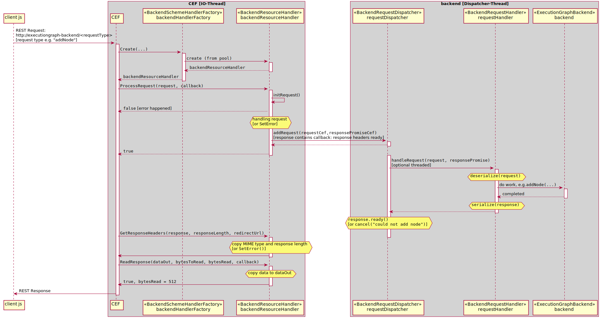
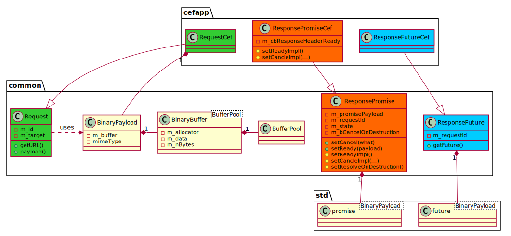

Specifications for Client and Backend Communication
===
In this document *client* is referred to the Angular implementation in `./client` which provides the GUI (HTML/CSS/TypeScript) implementation. The *backend*  is referred to the C++ implementation in `./backend`.

The communication between *client* and *backend* is done over the `./client/.../CefMessageRouterService.ts` which executes the pre-registered `window.cef.cefQuery` on the *client* side and the receiving router `m_router` in `./cefapp/AppHandler.hpp` which eventually forwards the request to the backend request dispatcher `./cefapp/BackendRequestDispatcher`. 
Binary message communication is done over the `./client/.../CefBinaryRouterService.ts` and the `BackendSchemeHandlerFactory` which also eventually forwards the request to the `.cefapp/BackendRequestDispatcher`. 
Instanced of type `BackendRequestHandler` are installed in the dispatcher `BackendSchemeHandlerFactory::m_dispatcher` for the backends, in this case the `backend/ExecututionGraphBackend.cpp`, which provides all functionality for reading, storing, manipulating and executing a graph consisting of `LogicNodes`.


The application registers two scheme handler factorys and creates a browser during `App::OnContextInitialized`. 
First, a scheme handler factory `ClientSchemeHandlerFactor` for the client requests (files and resources for the client angular application) is registered in `App::setupClient`.
Second, a backend request dispatcher `BackendRequestDispatcher` is created and its request handling loop (1 thread) is started.
Next, in function `App::setupBackend`, a scheme handler factory `BackendSchemeHandlerFactory` (sharing the backend request dispatcher) for the backend request handling is setup and then the `BackendFactory` creates the backends and its corresponding request handlers. At the moment, a backend instance of type `ExecutionGraphBackend` with its associated request handlers (sharing the backend), currently an instance of `DummyRequestHandler`, is created. All backend request handlers are then added to the backend request dispatcher.
After setting up the backend, a browser is created by `CefBrowserHost::CreateBrowser` in `App::setupBrowser` with an instance of type `AppHandler` (`CefClient`) which implements various CEF related handling functions.

## Message Send/Receive Workflow
Communication workflow for an REST Request on the scheme `http://executiongraph-backend` between the client and the backend:


During communication, a processed request by an instanciated `BackendResourceHandler` created by the
`BackendResourceHandlerFactory` will add the request to the dispatcher by calling the non-blocking function `BackendRequestDispatcher::addRequest(std::move(request), std::move(responsePromise))` with a request (`RequestCef`) and a response object (`ResponsePromiseCef`). Note that, the request and response promise are moved to the dispatcher (actually it gets moved into the task queue of the thread pool inside the dispatcher). Before doing this, the backend resource handler has exctracted the response future ( `RepsonseFuture`) which gets used when `BackendResourceHandler::GetResponseHeaders` and `BackendResourceHandler::ReadResponse` is called. The consumer thread of the backend request dispatcher then forwards this request/response to the corresponding registered handler. If no handler is found, the request is automatically cancled by calling `setCancel(...)` on the response promise.



## Serilaization of Messages
The messages get serialized and deserialized with [FlatBuffers](https://google.github.io/flatbuffers/).
The schemas can be found in `gui/executionGraphGui/messages/schemas`. The serialization of specific components of an execution graph are located in `include/executionGraph/serialization`.

## Message Types
One message handlers is associated for each of the following grouped functionalities:
The base template url of the backend is `http://executiongraph-backend/${requestUrl}` and all HTTP requests are sent to this url.

-   **Graph Mangement Queries**:
    RequestHandler: `gui/backend/requestHandler/GraphManagementRequestHandler.hpp`
    Client Service: `gui/client/.../app/services/GraphManagementServiceBinaryHttp.ts`
    * Add graph:
        - url: `requestUrl = "general/addGraph"`
        - request method: `POST`
        - schema: `gui/executionGraphGui/messages/schemas/GraphManagementMessages.fbs`
        - request `AddGraphRequest`
        - response: `AddGraphResponse`
    * Remove graph:
        - url: `requestUrl = "general/removeGraph"`
        - request method: `POST`
        - schema: `gui/executionGraphGui/messages/schemas/GraphManagementMessages.fbs`
        - request `RemoveGraphRequest`
        - response: `RemoveGraphRequest`

-   **General Info Queries** :
    RequestHandler: `gui/backend/requestHandler/GeneralInfoRequestHandler.hpp`
    Client Service: `gui/client/.../app/services/GeneralInfoServiceBinaryHttp.ts`
    * Get info of all available socket types and node types (of a graph):
        - url: `requestUrl = "general/getAllGraphTypeDescriptions"`
        - request method: `GET`
        - schema: `gui/executionGraphGui/messages/schemas/GeneralInfoMessages.fbs`
        - response: `GetAllGraphTypeDescriptionsResponse`

-   **Graph Info Queries**:
    * Info query on node(s):
    * Info query on connection(s):

-   **Serialization Functionalities**:
    * Load a graph from a `.eg` file into the backend and send a validated (possibly modified) graph summary info + the client serialization back to the client such that it can visualize it:

    * Serialize a graph to a `.eg` file. Corresponging of a serialization of the client data (gui visualization data) and graph data from the backend:

-   **Graph Manipulation Queries**:
    Request Handler: `gui/backend/requestHandler/GraphManipulationRequestHandler.hpp`
    Client Service: `gui/client/.../app/services/GraphManipulationServiceBinaryHttp.ts`
    * Add node:
        - url: `requestUrl = "graph/addNode"`
        - request method: `POST`
        - schema: `gui/executionGraphGui/messages/schemas/GraphManipulationMessages.fbs`
        - request: `AddNodeRequest`
        - response: `AddNodeResponse`
    * Add node:
        - url: `requestUrl = "graph/removeNode"`
        - request method: `POST`
        - schema: `gui/executionGraphGui/messages/schemas/GraphManipulationMessages.fbs`
        - request: `RemoveNodeRequest`
        - response: `RemoveNodeResponse`

    * Add/Remove connection(s):
    * Set/Get node settings (`group id`, possible other custom node specific settings):

- **Graph Execution Functionalities**:
    * Run graph:
    * Stop graph:

```